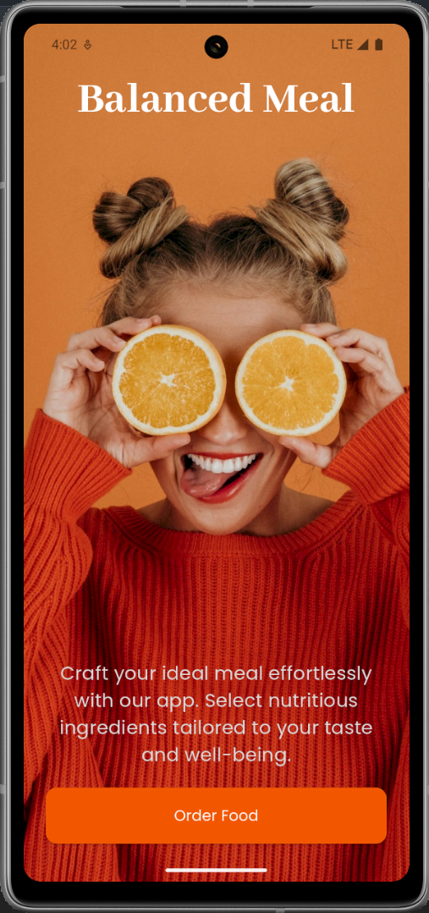
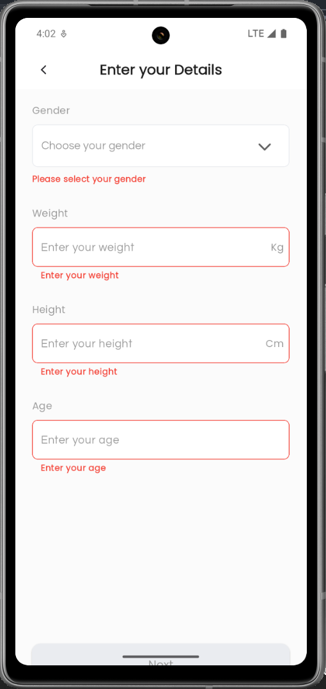
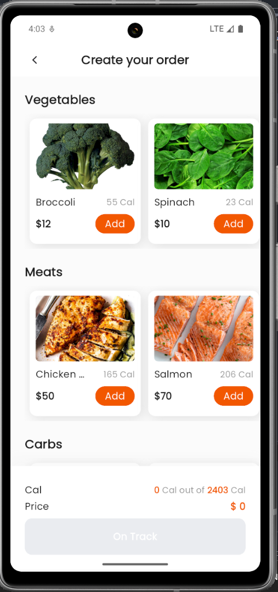
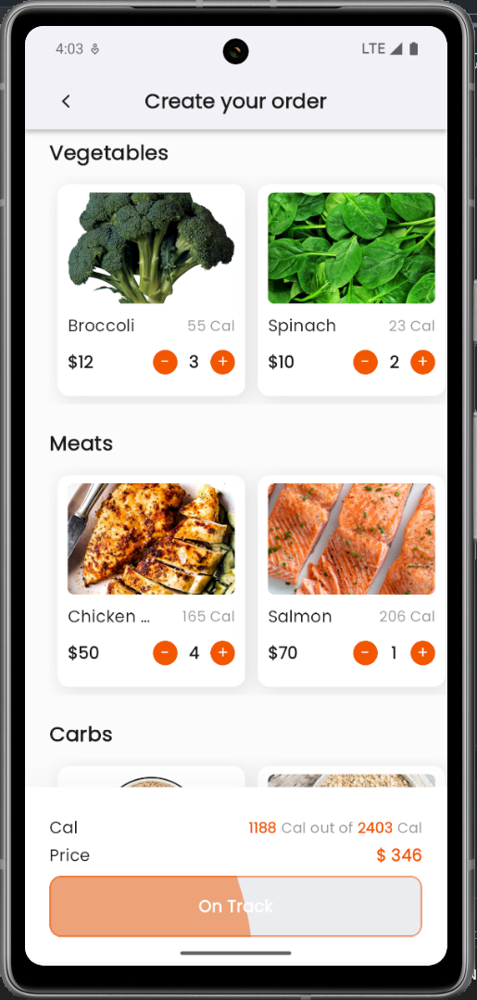
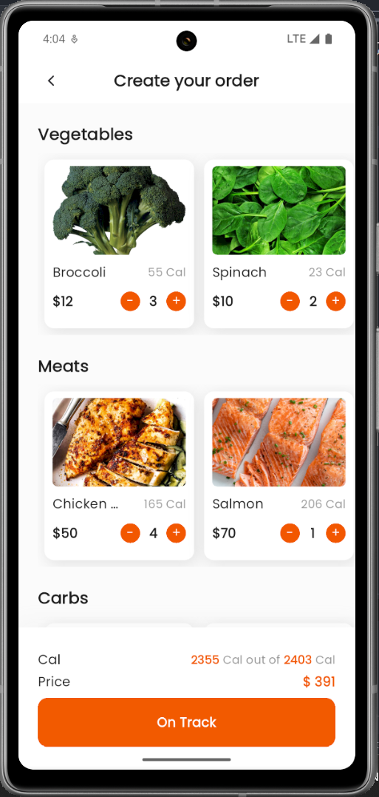
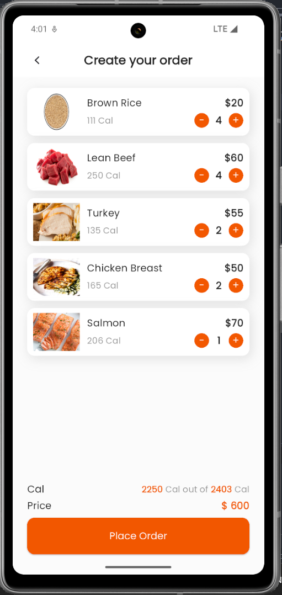
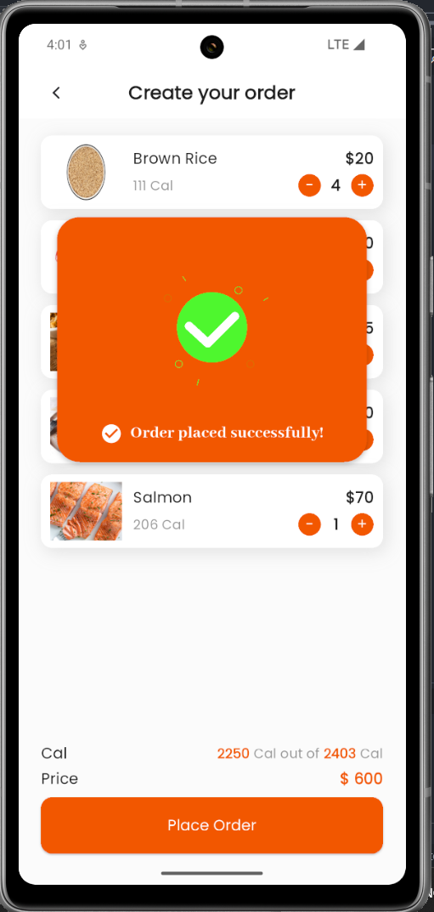

# balanced_meal

🚀 Introducing Balanced Meal – A Smart Meal Planner! 🍽️🔥

Excited to share my latest Flutter project: Balanced Meal, an intelligent meal-planning app that calculates the optimal daily calorie intake and recommends meals accordingly!

🔧 Tech Stack:
✅ MVVM Architecture – Clean and scalable code structure
✅ Provider – Efficient state management
✅ Dynamic Meal Selection – Users input their weight, height, age, and gender, and the app calculates their calorie needs
✅ Smart Meal Ordering – Meals are categorized (Carbs, Meat, Vegetables) and selected based on calorie requirements

🎯 Key Features:
📊 Calorie Calculation: Determines how many calories you need per day
🍛 Meal Recommendation: Suggests meals that fit within your daily calorie goal
🛒 Order Management: Allows users to build their own meal orders dynamically
💰 Price Calculation: Displays the total cost of selected meals

This project blends my passion for mobile app development with practical health-focused solutions. Looking forward to adding more features like macronutrient breakdown, meal customization, and user preferences!

## Getting Started

See [README.md](README.md)

## App Preview

### Screenshots

### Video Preview

)
